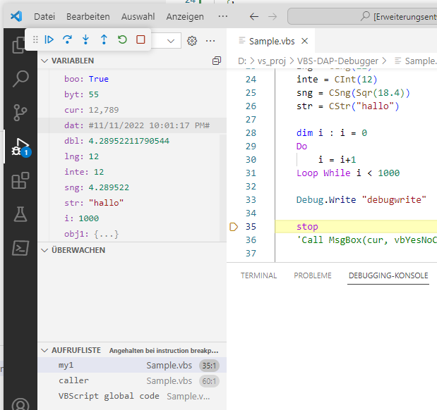

# Early Alpha #
VBScript Debugger using ActiveDbg, ProcessDebugManager, VSInterop which communicates via Debug Adapter Protocol.

Should by used for VBS-VSCode Extension

## Progress ##
- Parse aka Execute working
- Attach working
- DAP Communication with VSCode

## Problems ##
People who use VBS-VSCode Extension for simply running *.vbs files, get error in the new debugger because I currently only read the textfile and execute it, what i should do is launch cscript, attach to it and have access to WScript, WSH
That could really break a lot, have some ideas how to fix that, but time...

## useful links / references #

* https://web.archive.org/web/20021028111146/http://msdn.microsoft.com/msdnmag/issues/1200/active/default.aspx
* https://web.archive.org/web/20001117184300/http://www.microsoft.com/msj/defaultframe.asp?page=/msj/1099/visualprog/visualprog1099.htm
* https://web.archive.org/web/20140412122922/http://blogs.msdn.com/b/greggm/archive/2008/06/09/writing-a-script-debugger-without-using-the-mdm.aspx
*https://stackoverflow.com/questions/60422/idebugprogramprovider2-getproviderprocessdata-on-vista
* HKEY_LOCAL_MACHINE\SOFTWARE\WOW6432Node\Microsoft\VisualStudio\Debugger\JIT filter guid
* HKEY_USERS\.DEFAULT\Software\Microsoft\WDExpress\14.0_Config\AD7Metrics\Engine\{F200A7E7-DEA5-11D0-B854-00A0244A1DE2}
